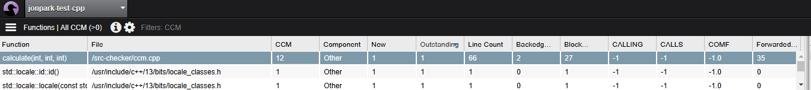

# Cyclomatic Complexity in C++ Code

Cyclomatic Complexity (CCM) is a software metric used to indicate the complexity of a program. It directly measures the number of linearly independent paths through a program's source code. Higher CCM values suggest more complex and potentially less maintainable code.

## CCM Calculation Rules

Cyclomatic Complexity is calculated based on the control flow graph of the program using the following rules:

1. Basic Complexity: The simplest program has a CCM of 1.
2. Control Flow Branches: Each if, for, while, case, and other control flow statements add to the CCM.
3. Logical Operators: Logical operators like && and || can also increase CCM by introducing additional paths.

## Example C++ Code with CCM Calculation

```cpp
#include <iostream>

using namespace std;

// Function declaration
int calculate(int a, int b, int c);

int main() {
    int x = 10;
    int y = 20;
    int z = 30;
    int result = calculate(x, y, z);
    cout << "Result: " << result << endl;
    return 0;
}

// Function with high Cyclomatic Complexity
int calculate(int a, int b, int c) {
    int CCM = 1; // Basic complexity

    // If statement 1: CCM += 1
    if (a > b) {
        CCM++;
        cout << "a is greater than b" << endl;
    }

    // If-else statement: CCM += 1
    if (b > c) {
        CCM++;
        cout << "b is greater than c" << endl;
    } else {
        CCM++;
        cout << "c is greater than or equal to b" << endl;
    }

    // For loop: CCM += 1
    for(int i = 0; i < 5; ++i) {
        CCM++;
        cout << "Iteration: " << i << endl;
    }

    // While loop: CCM += 1
    int count = 0;
    while(count < 3) {
        CCM++;
        cout << "Count: " << count << endl;
        count++;
    }

    // Switch-case statement: Each case adds to CCM
    int option = 2;
    switch(option) {
        case 1:
            CCM++;
            cout << "Option 1 selected" << endl;
            break;
        case 2:
            CCM++;
            cout << "Option 2 selected" << endl;
            break;
        case 3:
            CCM++;
            cout << "Option 3 selected" << endl;
            break;
        default:
            CCM++;
            cout << "Default option selected" << endl;
            break;
    }

    // Logical operators: Each '&&' or '||' adds to CCM
    if (a > 0 && b > 0) { // '&&' adds 1
        CCM++;
        cout << "Both a and b are positive" << endl;
    }

    if (a > 0 || c > 0) { // '||' adds 1
        CCM++;
        cout << "Either a or c is positive" << endl;
    }

    return CCM;
}
```

## Code Explanation and CCM Calculation

1. Basic Complexity:
   - CCM = 1
   - Every function starts with a CCM of 1.

2. First if Statement:
   - Condition: `if (a > b)`
   - CCM increases by 1.
   - Current CCM: 2

3. Second if-else Statement:
   - Condition: `if (b > c) ... else ...`
   - if and else constitute a single decision point, increasing CCM by 1.
   - Current CCM: 3

4. for Loop:
   - Condition: `for(int i = 0; i < 5; ++i)`
   - Loops introduce a new path, increasing CCM by 1.
   - Current CCM: 4

5. while Loop:
   - Condition: `while(count < 3)`
   - Another loop adds to CCM by 1.
   - Current CCM: 5

6. switch-case Statement:
   - Each case and default adds to CCM.
   - 4 cases (1, 2, 3, default) increase CCM by 4.
   - Current CCM: 9

7. Logical Operators (&& and ||):
   - `if (a > 0 && b > 0)`
     - && adds 1 to CCM.
     - Current CCM: 10
   - `if (a > 0 || c > 0)`
     - || adds 1 to CCM.
     - Final CCM: 11

## Final Cyclomatic Complexity

The `calculate` function has a final CCM value of 11.

### CCM Increase Summary

| Code Structure | CCM Increase | Description |
|----------------|--------------|-------------|
| Basic Complexity | 1 | Function starts with CCM = 1 |
| if (a > b) | +1 | Conditional branch |
| if (b > c) else | +1 | Conditional branch with else |
| for Loop | +1 | Loop introduces a new path |
| while Loop | +1 | Loop introduces a new path |
| switch-case (4 cases) | +4 | Each case and default adds a branch |
| if (a > 0 && b > 0) | +1 | Logical AND operator adds a branch |
| if (a > 0 \|\| c > 0) | +1 | Logical OR operator adds a branch |
| **Total Cyclomatic Complexity** | **11** | |

## Importance of Cyclomatic Complexity

Cyclomatic Complexity is crucial for several reasons:

1. Maintainability: High CCM indicates complex code that is harder to understand and maintain.
2. Testability: Higher CCM requires more test cases to achieve adequate test coverage.
3. Bug Risk: Complex code is more prone to bugs and errors.

## Optimizing Cyclomatic Complexity

To keep CCM manageable, consider the following practices:

1. Simplify Conditional Statements: Reduce the number of nested conditions and use simpler logic.
2. Refactor Functions: Break down large functions into smaller, single-responsibility functions.
3. Minimize switch-case Statements: Use polymorphism or other design patterns to handle multiple cases.
4. Limit Logical Operators: Avoid excessive use of && and || in conditional statements.

## Conclusion

Cyclomatic Complexity Metric (CCM) is a valuable tool for assessing and managing the complexity of your code. By understanding how different C++ structures affect CCM, you can write cleaner, more maintainable, and less error-prone code.

## CCM Calculation from compiled code
```bash
g++ ccm.cpp
./a.out
c is greater than or equal to b
Iteration: 0
Iteration: 1
Iteration: 2
Iteration: 3
Iteration: 4
Count: 0
Count: 1
Count: 2
Option 2 selected
Both a and b are positive
Either a or c is positive
Result: 13
```
## CCM Calculation from Coverity



## CCM 

https://learn.microsoft.com/en-us/visualstudio/code-quality/code-metrics-cyclomatic-complexity?view=vs-2022

https://www.mathworks.com/help/matlab/matlab_prog/measure-code-complexity-using-cyclomatic-complexity.html

https://www.sonarsource.com/learn/cyclomatic-complexity/

## Minimizing Cyclomatic Complexity with Pattern Matching

https://www.danylkoweb.com/Blog/minimizing-cyclomatic-complexity-with-pattern-matching-SR

https://www.rhyous.com/2017/10/19/eliminating-cylclomatic-complexity-by-replacing-switchcase-with-a-method-or-a-dictionary/