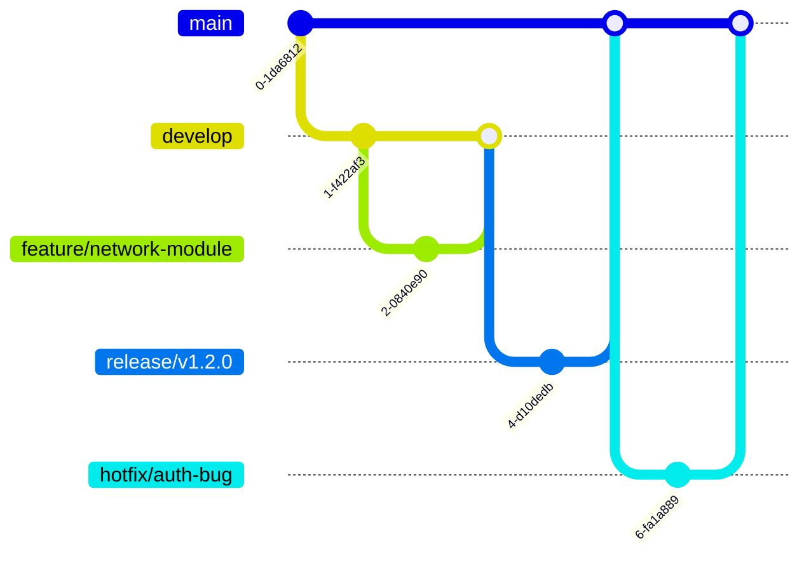

---

---
# **GitHub에서 새로운 Repository(저장소)를 생성하는 방법**

## **GitHub에서 새로운 Repository(저장소)를 생성하는 방법**

GitHub에서 새로운 **Repository(저장소)**를 생성하는 방법을 단계별로 설명하겠습니다.  
**방법 1:** GitHub 웹사이트에서 직접 생성하는 방법  
**방법 2:** Git CLI를 사용하여 터미널에서 생성하는 방법  

---

## **📝 방법 1: GitHub 웹사이트에서 직접 생성하기**
### **1️⃣ GitHub에 로그인**
- [GitHub 홈페이지](https://github.com/)에 접속 후 로그인합니다.

### **2️⃣ 새 저장소 생성 페이지 이동**
- 우측 상단의 **`+` 버튼**을 클릭한 후 **"New repository"** 선택
- 또는 직접 [새 저장소 생성 페이지](https://github.com/new)로 이동

### **3️⃣ 저장소 정보 입력**
- **Repository name (필수):** 저장소 이름을 입력합니다. (예: `my-new-repo`)
- **Description (선택):** 저장소에 대한 설명을 입력합니다.
- **Visibility 선택:**
  - `Public`(공개) → 누구나 볼 수 있음.
  - `Private`(비공개) → 본인과 초대한 사용자만 접근 가능.

### **4️⃣ 추가 설정**
- ✅ `Initialize this repository with a README` (선택)
  - 체크하면 기본적인 `README.md` 파일이 생성됨.
- ✅ `.gitignore` (선택)
  - 특정 파일을 Git에서 무시하도록 설정 (예: Python, Node.js 등).
- ✅ `License` (선택)
  - 오픈소스 라이선스를 설정 (예: MIT, Apache 2.0 등).

### **5️⃣ 저장소 생성**
- **"Create repository"** 버튼을 클릭하면 저장소가 생성됩니다.

### **6️⃣ 로컬 프로젝트와 연결**
이제 로컬에서 작업 중인 프로젝트를 GitHub 저장소에 연결할 수 있습니다.

```sh
# 1. 로컬에서 Git 초기화 (저장소가 없을 경우)
git init

# 2. 원격 저장소 추가
git remote add origin https://github.com/사용자이름/my-new-repo.git

# 3. 변경 사항 커밋 및 푸시
git add .
git commit -m "Initial commit"
git push -u origin main
```

---

## **🖥️ 방법 2: Git CLI로 GitHub에서 저장소 생성하기**
GitHub CLI(`gh`)를 사용하면 터미널에서 저장소를 생성할 수도 있습니다.

### **1️⃣ GitHub CLI 설치**
- 먼저 GitHub CLI(GitHub Command Line Interface)를 설치해야 합니다.
  - **Windows:** [다운로드 링크](https://cli.github.com/)
  - **macOS:** `brew install gh`
  - **Linux:** `sudo apt install gh`

### **2️⃣ GitHub 로그인**
GitHub CLI를 통해 로그인합니다.
```sh
gh auth login
```
- GitHub 계정 로그인 후 OAuth 토큰을 설정하면 CLI에서 GitHub API를 사용할 수 있습니다.

### **3️⃣ 새로운 저장소 생성**
```sh
gh repo create my-new-repo --public --clone
```
📌 **설명**
- `my-new-repo` → 저장소 이름
- `--public` → 공개 저장소 (비공개 저장소는 `--private` 사용)
- `--clone` → 로컬에 자동으로 복제

### **4️⃣ 로컬 프로젝트와 연결**
만약 기존 프로젝트가 있다면 아래 명령어로 원격 저장소에 연결합니다.
```sh
git remote add origin https://github.com/사용자이름/my-new-repo.git
git branch -M main
git push -u origin main
```

---

## **🚀 마무리**
✅ **GitHub 웹사이트에서 직접 저장소 생성** → 가장 쉬운 방법  
✅ **GitHub CLI(`gh`)를 사용하여 터미널에서 생성** → 빠르고 효율적인 방법  
✅ **로컬 프로젝트를 GitHub와 연결하여 원격 저장소로 관리 가능**  

이제 새 GitHub 저장소에서 개발을 시작해보세요! 🎉🚀
---

# **Git Workflow 상세 설명**

Git을 사용하여 프로젝트를 효과적으로 관리하려면 올바른 **Git Workflow**를 이해하는 것이 중요합니다.  
Git Workflow는 프로젝트의 코드 협업과 버전 관리를 위한 규칙과 프로세스를 정의하는 개념입니다.  

---

## **1. 기본적인 Git Workflow**
기본적인 Git Workflow는 다음 단계를 포함합니다.

1. **작업 디렉토리에서 파일 수정**
2. **`git add`를 사용하여 스테이징(Staging)**
3. **`git commit`을 사용하여 로컬 저장소(Local Repository)에 기록**
4. **`git push`를 사용하여 원격 저장소(Remote Repository)에 업로드**
5. **필요하면 `git pull` 또는 `git fetch`를 사용하여 최신 변경 사항 가져오기**
6. **협업 시 `git branch`와 `git merge` 또는 `git rebase`를 활용하여 코드 통합**

```sh
# 1. 원격 저장소에서 최신 코드 가져오기
git pull origin main

# 2. 새 기능 개발을 위해 브랜치 생성 및 이동
git checkout -b feature-new

# 3. 파일 수정 후 스테이징
git add .

# 4. 커밋
git commit -m "새로운 기능 추가"

# 5. 원격 저장소로 푸시
git push origin feature-new

# 6. PR(풀 리퀘스트, Merge 요청) 또는 main 브랜치로 병합
git checkout main
git merge feature-new

# 7. 정리 (로컬 브랜치 삭제)
git branch -d feature-new
```

---

## **2. Git Workflow의 종류**
다양한 Git Workflow가 존재하며, 팀과 프로젝트에 따라 적절한 방식을 선택하여 사용합니다.

### **(1) Centralized Workflow (중앙집중식 워크플로우)**
- SVN(서브버전)과 유사한 방식으로 Git을 사용하는 방법.
- 모든 개발자가 `main` (또는 `master`) 브랜치에서 직접 작업.
- 간단한 프로젝트에서는 가능하지만, 협업 시 충돌이 자주 발생.

📌 **사용 방법**
```sh
git pull origin main  # 최신 코드 가져오기
git add .
git commit -m "작업 내용"
git push origin main
```
✅ **장점:** 배우기 쉽고 간단함.  
❌ **단점:** 병렬 개발이 어렵고, 코드 충돌이 자주 발생할 수 있음.

---

### **(2) Feature Branch Workflow (기능 브랜치 워크플로우)**
- 모든 기능(feature) 개발을 별도의 브랜치에서 진행 후, 완성되면 `main` 브랜치로 병합.
- `main` 브랜치는 항상 배포 가능한 상태로 유지.

📌 **사용 방법**
```sh
git checkout -b feature-login  # 새 기능 브랜치 생성
# 코드 수정
git add .
git commit -m "로그인 기능 추가"
git push origin feature-login  # 원격 저장소에 푸시

# (이후 GitHub/GitLab에서 Pull Request 생성 후 리뷰 후 병합)
```
✅ **장점:** `main` 브랜치를 안전하게 유지하며 기능별 개발 가능.  
❌ **단점:** 브랜치가 많아질 경우 관리가 어려울 수 있음.

---

### **(3) Gitflow Workflow (깃플로우 워크플로우)**
- **Vincent Driessen**이 제안한 방식으로, 협업을 위한 체계적인 브랜치 전략.
- `main`, `develop`, `feature`, `release`, `hotfix` 브랜치를 사용.
- `develop` 브랜치는 개발 브랜치, `main`은 배포 브랜치.

📌 **브랜치 역할**
| 브랜치 | 역할 |
|--------|------|
| `main` | 실제 배포되는 안정적인 코드 (production) |
| `develop` | 개발을 진행하는 브랜치 |
| `feature/` | 새로운 기능 개발 브랜치 (`develop`에서 생성) |
| `release/` | 배포 준비 브랜치 (`develop`에서 생성) |
| `hotfix/` | 긴급 수정 브랜치 (`main`에서 생성) |

📌 **사용 방법**
```sh
# 1. 새로운 기능 개발
git checkout develop
git checkout -b feature-authentication
# 기능 개발 후
git commit -m "사용자 인증 기능 추가"
git push origin feature-authentication

# 2. 기능 완료 후 develop 브랜치로 병합
git checkout develop
git merge feature-authentication
git push origin develop

# 3. 배포를 위해 release 브랜치 생성
git checkout -b release-v1.0
# 배포 준비 완료 후 main으로 병합
git checkout main
git merge release-v1.0
git push origin main

# 4. 긴급 수정 (hotfix)
git checkout main
git checkout -b hotfix-login-bug
# 버그 수정 후
git commit -m "로그인 버그 수정"
git push origin hotfix-login-bug
```
✅ **장점:** 안정적인 배포가 가능하고, 체계적인 개발 프로세스를 유지 가능.  
❌ **단점:** 브랜치가 많아져 관리가 복잡해질 수 있음.

---

### **(4) GitHub Flow (깃허브 플로우)**
- Gitflow를 단순화한 방식으로, `main`과 `feature` 브랜치만 사용.
- `main` 브랜치는 항상 배포 가능한 상태로 유지하며, 기능 개발은 브랜치에서 진행 후 PR을 통해 병합.

📌 **사용 방법**
```sh
git checkout -b feature-dashboard
# 개발 후
git commit -m "대시보드 추가"
git push origin feature-dashboard
```
- 이후 GitHub에서 **Pull Request (PR)** 생성 후 코드 리뷰 및 병합.

✅ **장점:** 간단하고 빠른 개발 가능.  
❌ **단점:** 대규모 프로젝트에서는 관리가 어려울 수 있음.

---

## **3. Git의 주요 명령어 정리**
| 명령어 | 설명 |
|--------|------|
| `git init` | 새로운 Git 저장소 생성 |
| `git clone <url>` | 원격 저장소 복사 |
| `git status` | 현재 작업 상태 확인 |
| `git add .` | 변경된 파일을 스테이징 |
| `git commit -m "메시지"` | 변경 사항을 로컬 저장소에 커밋 |
| `git push origin <branch>` | 원격 저장소에 푸시 |
| `git pull origin <branch>` | 원격 저장소의 변경 사항 가져오기 |
| `git checkout -b <branch>` | 새 브랜치 생성 및 이동 |
| `git merge <branch>` | 다른 브랜치를 현재 브랜치에 병합 |
| `git rebase <branch>` | 다른 브랜치를 현재 브랜치에 합치되, 커밋 히스토리를 정리 |
| `git log --oneline` | 커밋 내역을 한 줄로 보기 |
| `git reset --hard <commit>` | 특정 커밋으로 되돌리기 (주의!) |
| `git stash` | 현재 변경 사항을 임시 저장 |

---

## **4. Git Workflow 선택 가이드**
| 사용 사례 | 추천 Workflow |
|----------|--------------|
| 간단한 프로젝트 | **Centralized Workflow** |
| 협업 및 기능 단위 개발 | **Feature Branch Workflow** |
| 대규모 팀 협업 | **Gitflow Workflow** |
| 빠른 개발 및 배포 | **GitHub Flow** |

✅ **작은 프로젝트** → Feature Branch 또는 GitHub Flow  
✅ **대규모 협업 프로젝트** → Gitflow  

---

## **5. 결론**
Git Workflow를 잘 활용하면 협업을 더욱 효과적으로 진행할 수 있습니다.  
- **작은 프로젝트**에서는 간단한 Feature Branch Workflow나 GitHub Flow를 사용.
- **대규모 프로젝트**에서는 체계적인 Gitflow를 활용하여 개발 프로세스를 정리.

**팀의 필요와 프로젝트의 성격에 맞는 Workflow를 선택하여 활용하세요!** 🚀


---

# **Git에서 원격(remote) 저장소 URL을 확인하는 방법**

### **Git에서 원격(remote) 저장소 URL을 확인하는 방법**

#### **1. `git remote -v` 명령어 사용 (가장 일반적인 방법)**
```sh
git remote -v
```
📌 **출력 예시:**
```
origin  https://github.com/JongYongPark/my-repo.git (fetch)
origin  https://github.com/JongYongPark/my-repo.git (push)
```
- `origin`: 기본 원격 저장소 이름
- `(fetch)`: 가져오기(fetch) 용도
- `(push)`: 푸시(push) 용도

---

#### **2. 특정 원격 저장소 URL 확인 (`git remote get-url`)**
```sh
git remote get-url origin
```
📌 **출력 예시:**
```
https://github.com/JongYongPark/my-repo.git
```
- 특정 원격(remote)의 URL을 확인할 때 사용.

**SSH 방식으로 설정된 경우 예시**
```
git@github.com:JongYongPark/my-repo.git
```

---

#### **3. 자세한 원격 저장소 정보 확인 (`git remote show`)**
```sh
git remote show origin
```
📌 **출력 예시:**
```
* remote origin
  Fetch URL: https://github.com/JongYongPark/my-repo.git
  Push  URL: https://github.com/JongYongPark/my-repo.git
  HEAD branch: main
  Remote branches:
    main    tracked
    develop tracked
```
- `Fetch URL`과 `Push URL`을 포함한 원격 저장소의 정보가 출력됨.
- 현재 추적 중인 원격 브랜치 정보도 제공됨.

---

### **추가: 원격 저장소 URL 변경 방법**
#### **1. HTTPS → SSH 변경**
```sh
git remote set-url origin git@github.com:JongYongPark/my-repo.git
```

#### **2. SSH → HTTPS 변경**
```sh
git remote set-url origin https://github.com/JongYongPark/my-repo.git
```

#### **3. 원격 저장소 제거**
```sh
git remote remove origin
```

---

✅ **추천 방법:**  
원격 저장소 URL을 확인할 때 **`git remote -v`** 또는 **`git remote get-url origin`** 을 사용하면 가장 간단하고 빠르게 확인할 수 있습니다. 🚀


---

# **`git pull` vs `git fetch` 차이점**

Git에서 `git pull`과 `git fetch`는 모두 원격 저장소에서 변경 사항을 가져오는 역할을 합니다.  
그러나 **작동 방식과 목적이 다릅니다**.

---

## **1. `git fetch`란?**
🚀 **원격 저장소의 변경 사항을 가져오지만, 로컬 브랜치에는 반영하지 않음.**

```sh
git fetch origin
```

📌 **설명**
- 원격 저장소(`origin`)의 최신 변경 사항을 로컬 저장소의 **참조(refs) 데이터**로만 업데이트함.
- 로컬 브랜치에는 영향을 주지 않으며, 직접 머지(`merge`)하거나 리베이스(`rebase`)해야 변경 사항을 반영할 수 있음.

📌 **사용 예시**
```sh
git fetch origin
git log origin/main --oneline  # 원격 브랜치의 변경 사항 확인
git merge origin/main  # 변경 사항을 로컬에 병합
```

✅ **장점**
- 로컬 브랜치를 안전하게 유지하면서 최신 상태를 확인할 수 있음.
- 원격 변경 사항을 검토한 후 병합할 수 있어 충돌 가능성을 줄일 수 있음.

❌ **단점**
- `fetch`만으로는 코드가 자동으로 업데이트되지 않음. `merge` 또는 `rebase`가 필요함.

---

## **2. `git pull`이란?**
🚀 **원격 저장소의 변경 사항을 가져오고, 자동으로 현재 브랜치에 병합(`merge`)하거나 리베이스(`rebase`)함.**

```sh
git pull origin main
```

📌 **설명**
- `git fetch` + `git merge` 또는 `git rebase`를 자동으로 수행.
- 원격 저장소의 변경 사항이 바로 로컬 브랜치에 반영됨.

📌 **사용 예시**
```sh
git pull origin main  # 원격 저장소의 최신 변경 사항을 가져와 자동 병합
```

✅ **장점**
- 빠르고 간편하게 원격 저장소의 최신 상태를 유지할 수 있음.
- 한 번의 명령어로 `fetch`와 `merge`를 수행.

❌ **단점**
- 변경 사항을 직접 검토할 기회 없이 자동으로 병합이 진행되므로, 예상치 못한 충돌(conflict)이 발생할 가능성이 있음.

---

## **3. `git fetch` vs `git pull` 차이점 정리**
| 비교 항목 | `git fetch` | `git pull` |
|-----------|------------|------------|
| 원격 변경 사항 가져오기 | ✅ 가져옴 (하지만 로컬에 반영 X) | ✅ 가져옴 (그리고 자동 병합) |
| 로컬 브랜치 업데이트 | ❌ 직접 `merge` 필요 | ✅ 자동 병합 |
| 충돌 가능성 | ❌ 없음 (병합 전 확인 가능) | ⚠️ 있음 (자동 병합되므로) |
| 사용 목적 | 최신 변경 사항 확인 후 병합할지 결정 | 바로 병합하여 최신 상태 유지 |
| 명령어 조합 | `git fetch` + `git merge` | `git fetch` + `git merge` 자동 수행 |

---

## **4. `git fetch`를 사용해야 할 때**
- 원격 저장소의 최신 변경 사항을 **검토한 후 병합하고 싶을 때**.
- **충돌을 방지하고 싶을 때** (자동 병합이 되지 않으므로 안전함).
- CI/CD(배포 파이프라인)에서 원격 상태를 동기화하지만, 즉시 반영하지 않고 싶을 때.

📌 **추천 워크플로우**
```sh
git fetch origin
git diff main origin/main  # 변경 사항 확인
git merge origin/main  # 안전하게 병합
```

---

## **5. `git pull`을 사용해야 할 때**
- **혼자 작업하는 경우** 또는 **빠르게 최신 변경 사항을 반영하고 싶을 때**.
- **동료 개발자가 작업한 내용을 바로 가져와야 할 때**.

📌 **추천 워크플로우**
```sh
git pull origin main
```
(단, 충돌 발생 가능성이 있으므로 주의해야 함)

---

## **6. 추가: `git pull --rebase`**
🚀 `git pull`은 기본적으로 `fetch` 후 `merge`를 수행하지만, `rebase`를 사용할 수도 있음.

```sh
git pull --rebase origin main
```

📌 **설명**
- `git merge` 대신 `git rebase`를 수행하여 **더 깔끔한 커밋 히스토리 유지** 가능.
- `merge`를 사용하면 `merge commit`이 생기지만, `rebase`를 사용하면 커밋이 일렬로 정리됨.

📌 **추천 시나리오**
- 협업 시 **Git 커밋 히스토리를 깔끔하게 유지**하고 싶을 때.
- 로컬에서 진행한 커밋을 원격 커밋 뒤에 순서대로 적용하고 싶을 때.

---

## **7. 결론**
| 상황 | 추천 명령어 |
|------|------------|
| 원격 변경 사항을 가져와 검토 후 병합하고 싶을 때 | `git fetch` + `git merge` |
| 최신 변경 사항을 빠르게 반영하고 싶을 때 | `git pull` |
| 히스토리를 깔끔하게 유지하고 싶을 때 | `git pull --rebase` |

📌 **요약**
- 안전하게 최신 상태를 확인하려면 **`git fetch`**
- 빠르게 최신 코드로 업데이트하려면 **`git pull`**
- 히스토리를 정리하면서 업데이트하려면 **`git pull --rebase`**

---

✅ **실제 프로젝트에서는 충돌 방지를 위해 `git fetch`를 먼저 하고, 변경 사항을 확인한 후 병합하는 것이 더 안전한 방법입니다.** 🚀


---

# **Git Merge vs Git Rebase 비교**
Git에서 브랜치를 병합하는 방법에는 **`git merge`**와 **`git rebase`** 두 가지 방법이 있습니다.  
두 방법 모두 브랜치를 병합하는 역할을 하지만, **커밋 히스토리 관리 방식이 다릅니다.**

---

## **1. `git merge`란?**
🚀 **두 브랜치를 병합(Merge Commit 생성)하여, 기존 커밋 히스토리를 유지하면서 새로운 병합 커밋을 만듦.**

📌 **사용 예시**
```sh
git checkout main
git merge feature-branch
```

📌 **설명**
- `feature-branch`의 변경 사항을 `main` 브랜치에 병합.
- `main` 브랜치와 `feature-branch`의 **공통 조상(commit)**을 기준으로 병합.
- 새 커밋(`merge commit`)이 생성됨.

📌 **장점**
✅ **커밋 히스토리가 보존됨** (브랜치 병합이 명확하게 보임)  
✅ 협업에서 충돌 관리가 쉬움  

📌 **단점**
❌ **불필요한 병합 커밋이 생성될 수 있음**  
❌ 브랜치가 많아지면 히스토리가 복잡해질 수 있음  

---

## **2. `git rebase`란?**
🚀 **브랜치를 다른 브랜치의 최신 커밋으로 "재배치"하여, 병합 커밋 없이 깔끔한 히스토리를 유지.**

📌 **사용 예시**
```sh
git checkout feature-branch
git rebase main
```

📌 **설명**
- `feature-branch`의 모든 커밋을 `main` 브랜치의 최신 상태로 **재배치(reapply)**.
- **기존 커밋을 새로운 커밋으로 변경**하여, 브랜치가 마치 `main`에서 직접 시작한 것처럼 보이게 함.
- `merge commit`이 생성되지 않음.

📌 **장점**
✅ **커밋 히스토리가 깔끔해짐**  
✅ **불필요한 병합 커밋이 없어짐**  
✅ `git log`가 직관적으로 유지됨  

📌 **단점**
❌ **이미 푸시된 커밋을 rebase하면 충돌 위험이 커짐**  
❌ **협업 시 다른 개발자와 히스토리가 꼬일 위험이 있음**  

---

## **3. `git merge` vs `git rebase` 차이점**
| 비교 항목 | `git merge` | `git rebase` |
|----------|------------|--------------|
| **작동 방식** | 두 브랜치를 병합하고 새로운 병합 커밋(Merge Commit) 생성 | 커밋을 다른 브랜치의 최신 상태로 재배치 |
| **커밋 히스토리** | 브랜치가 합쳐진 기록이 남음 | 병합 커밋 없이, 마치 한 줄로 이어진 것처럼 보임 |
| **커밋 충돌 발생 시** | 충돌 후 수동으로 해결, 병합 커밋 생성 | 충돌이 발생하면 각 커밋마다 해결해야 함 |
| **사용 시점** | 협업 중일 때, 원본 히스토리를 유지하고 싶을 때 | 로컬에서만 작업할 때, 히스토리를 깔끔하게 유지하고 싶을 때 |
| **복잡성** | 단순 (자동으로 merge) | 어려움 (각 커밋을 하나씩 재배치) |
| **협업에 적합한가?** | ✅ 협업에 적합 (공유된 브랜치에 사용 가능) | ⚠️ 주의 필요 (공유된 브랜치에 사용하면 안됨) |

---

## **4. `git merge` vs `git rebase` 히스토리 차이**
### **(1) `git merge`의 커밋 히스토리**
```plaintext
*   D (Merge Commit)  ← main
|\
| * C  ← feature-branch
| * B
|/
* A  ← main (공통 조상)
```
- 브랜치가 **합쳐진 기록이 남음**.
- `D`(Merge Commit)가 `main`과 `feature-branch`를 병합한 커밋.

### **(2) `git rebase`의 커밋 히스토리**
```plaintext
* C'  ← feature-branch
* B'
* A  ← main (공통 조상)
```
- `feature-branch`의 커밋 `B`와 `C`가 `main` 위로 **재배치됨**.
- 병합 커밋 없이 **마치 `feature-branch`가 `main`에서 바로 시작한 것처럼 보임**.
- 기존 커밋 `B`와 `C`는 `B'`, `C'`로 새로운 커밋으로 변경됨.

---

## **5. `git rebase` 사용 시 주의할 점**
🚨 **이미 원격 저장소(`origin`)에 푸시된 브랜치를 rebase하면 히스토리가 꼬일 수 있음.**  
**다른 개발자가 같은 브랜치를 사용하고 있다면 `rebase`는 피하는 것이 좋음!**  

✅ **로컬에서만 사용하거나, 자신의 브랜치에서 사용해야 안전함.**  
✅ **공유된 브랜치에서는 `merge`를 사용하는 것이 좋음.**  

```sh
git pull --rebase origin main  # 최신 코드 반영 (rebase 방식)
```
- 로컬에서만 사용하는 경우 `rebase`를 활용하면 히스토리를 깔끔하게 유지할 수 있음.

---

## **6. 언제 `merge` vs `rebase`를 사용해야 할까?**
| 상황 | `git merge` 추천 | `git rebase` 추천 |
|------|----------------|----------------|
| 협업 프로젝트 | ✅ | ❌ |
| 로컬에서 브랜치 정리 | ❌ | ✅ |
| 원격 브랜치 관리 | ✅ | ❌ |
| 커밋 히스토리 유지 | ✅ | ❌ |
| 히스토리 깔끔하게 유지 | ❌ | ✅ |

### **📌 추천 가이드**
✅ **팀 협업 중이라면?** → `git merge` 사용 (충돌 관리가 쉬움)  
✅ **혼자 작업하는 브랜치라면?** → `git rebase` 사용 (히스토리 깔끔)  
✅ **원격 저장소와 동기화할 때?** → `git pull --rebase` 사용 (충돌 최소화)  

---

## **7. 결론**
| 방식 | `git merge` | `git rebase` |
|------|------------|-------------|
| ✅ **쉽고 안전함** | 병합 커밋이 생기지만 협업 시 안전함 | 커밋 히스토리를 깔끔하게 유지 |
| ❌ **단점** | 불필요한 Merge Commit이 생길 수 있음 | 원격 브랜치에서 사용하면 충돌 위험 |

💡 **무조건 하나만 사용하는 것이 아니라, 상황에 맞게 적절히 활용하는 것이 중요합니다!** 🚀


---

# **Git Conflict (충돌) 발생 원인 및 해결 방법**
Git을 사용할 때 `git pull`, `git fetch`, `git commit`, `git merge`, `git rebase`, `git push` 등의 과정에서 **충돌(conflict)**이 발생할 수 있습니다.  
각 경우에 따라 **왜 충돌이 발생하는지**와 **어떻게 해결해야 하는지**를 정리해보겠습니다.  

---

## **1. `git pull` 시 충돌**
🚀 **발생 원인:**  
- 원격 저장소(`origin/main`)에 있는 최신 커밋이 **로컬 브랜치와 다를 때** 발생.
- 같은 파일을 **동시에 여러 사람이 수정**했을 때.

📌 **충돌 재현**
```sh
# 원격 저장소에 최신 변경 사항이 있음
git pull origin main
```
⛔ **Error 메시지 예시**
```
Auto-merging index.html
CONFLICT (content): Merge conflict in index.html
Automatic merge failed; fix conflicts and then commit the result.
```

✅ **해결 방법**
1. `git status`로 충돌이 발생한 파일 확인:
   ```sh
   git status
   ```
2. 충돌이 발생한 파일 열기 (`index.html` 예시):
   ```html
   <<<<<<< HEAD
   로컬 변경 사항
   =======
   원격 변경 사항
   >>>>>>> origin/main
   ```
3. 충돌 부분을 직접 수정한 후 저장.
4. 변경 사항을 스테이징하고 커밋:
   ```sh
   git add index.html
   git commit -m "Resolve merge conflict"
   git push origin main
   ```

---

## **2. `git fetch` 시 충돌**
🚀 **발생 원인:**  
- `git fetch` 자체로는 충돌이 발생하지 않음.
- 하지만 `git fetch` 후 `git merge` 또는 `git rebase`를 수행하면 충돌이 발생할 수 있음.

✅ **해결 방법**
- `git fetch` 이후 충돌이 발생하면 `git merge` 또는 `git rebase` 과정에서 충돌 해결이 필요함.

---

## **3. `git commit` 시 충돌**
🚀 **발생 원인:**  
- 일반적으로 `git commit` 시 충돌이 발생하지 않음.
- 하지만 `git commit --amend`를 사용할 때, 이미 푸시된 커밋을 수정하면 충돌 가능.

✅ **해결 방법**
- `commit --amend` 사용 시 신중하게 실행:
  ```sh
  git commit --amend
  git push --force origin main  # 강제 푸시는 충돌을 유발할 수 있음 (주의!)
  ```

---

## **4. `git merge` 시 충돌**
🚀 **발생 원인:**  
- 서로 다른 브랜치에서 같은 파일의 **같은 부분을 수정했을 때** 발생.
- 예를 들어, `feature-branch`와 `main`이 서로 다른 방식으로 같은 파일을 수정한 경우.

📌 **충돌 재현**
```sh
git checkout main
git merge feature-branch
```
⛔ **Error 메시지 예시**
```
Auto-merging src/app.js
CONFLICT (content): Merge conflict in src/app.js
Automatic merge failed; fix conflicts and then commit the result.
```

✅ **해결 방법**
1. `git status`로 충돌 파일 확인:
   ```sh
   git status
   ```
2. 충돌 파일 열기 (`src/app.js` 예시):
   ```js
   <<<<<<< HEAD
   console.log("Main branch 변경 사항");
   =======
   console.log("Feature branch 변경 사항");
   >>>>>>> feature-branch
   ```
3. 충돌 부분을 수동으로 수정하고 저장.
4. 변경 사항 스테이징 후 커밋:
   ```sh
   git add src/app.js
   git commit -m "Resolve merge conflict"
   ```
5. 병합 완료 후 푸시:
   ```sh
   git push origin main
   ```

---

## **5. `git rebase` 시 충돌**
🚀 **발생 원인:**  
- `rebase`는 커밋을 재배치하기 때문에 **각 커밋마다 충돌이 발생할 수 있음.**
- 로컬 브랜치가 원격 브랜치와 다르게 변경된 경우.

📌 **충돌 재현**
```sh
git checkout feature-branch
git rebase main
```
⛔ **Error 메시지 예시**
```
Applying: 변경 사항 적용 중...
CONFLICT (content): Merge conflict in src/app.js
error: could not apply commit_hash
```

✅ **해결 방법**
1. `git status`로 충돌 확인.
2. 충돌 파일을 열어 충돌 해결 후 저장.
3. 충돌 해결 후 `git rebase --continue` 실행:
   ```sh
   git add .
   git rebase --continue
   ```
4. 만약 충돌이 너무 복잡하면 `git rebase --abort`로 되돌릴 수도 있음:
   ```sh
   git rebase --abort
   ```

---

## **6. `git push` 시 충돌**
🚀 **발생 원인:**  
- 로컬 브랜치가 원격 브랜치보다 뒤쳐져 있을 때 (`pull`이 필요할 때).
- 강제 푸시 (`git push --force`)가 다른 개발자의 변경 사항을 덮어쓸 위험이 있음.

📌 **충돌 재현**
```sh
git push origin main
```
⛔ **Error 메시지 예시**
```
! [rejected]        main -> main (non-fast-forward)
error: failed to push some refs to 'https://github.com/user/repo.git'
```

✅ **해결 방법**
1. 최신 변경 사항을 가져온 후 다시 푸시:
   ```sh
   git pull origin main --rebase
   git push origin main
   ```
2. 강제 푸시가 필요한 경우 (`주의!`):
   ```sh
   git push --force origin main
   ```
   - ⚠️ `--force` 사용 시, 원격의 변경 사항이 덮어씌워질 수 있으므로 신중하게 사용해야 함.
   - 안전한 강제 푸시는 `git push --force-with-lease`:
     ```sh
     git push --force-with-lease origin main
     ```

---

## **🚀 충돌 해결 시 기본 원칙**
| 원칙 | 설명 |
|------|------|
| **1. `git status` 먼저 확인** | 충돌이 난 파일을 확인하려면 `git status` 실행 |
| **2. 충돌 파일 직접 수정** | `<<<<<<<`, `=======`, `>>>>>>>` 부분을 직접 해결 |
| **3. 변경 사항 커밋** | 수정 후 `git add . && git commit -m "Resolve conflict"` 실행 |
| **4. 복잡한 충돌 시 `git merge --abort`** | 병합이 너무 복잡하면 병합을 취소 |
| **5. rebase 중 문제 발생 시 `git rebase --abort`** | rebase를 되돌릴 수 있음 |
| **6. 강제 푸시(`--force`)는 신중하게 사용** | 가능하면 `--force-with-lease` 사용 |

---

## **🎯 결론**
✅ **`git merge`**: 두 브랜치를 병합할 때 충돌 발생 가능 → **수동으로 해결 후 커밋**  
✅ **`git rebase`**: 커밋을 재배치할 때 충돌 발생 가능 → **각 커밋마다 해결 후 `git rebase --continue`**  
✅ **`git push`**: 원격 저장소와 로컬 저장소가 다를 때 충돌 발생 → **`git pull --rebase` 후 푸시**  
✅ **`git pull`**: 원격 변경 사항과 로컬 변경 사항이 다를 때 충돌 발생 → **충돌 해결 후 커밋**  

💡 **Git 충돌을 줄이려면?**
- **항상 `git fetch` 후 `git merge/rebase` 하여 최신 코드 유지**  
- **한 번에 너무 많은 변경 사항을 병합하지 않기**  
- **팀원과 협업 시 `rebase`보다는 `merge`를 활용하여 충돌 최소화**  

🚀 **이제 Git 충돌을 두려워하지 말고, 문제 발생 시 해결할 수 있도록 연습해보세요!** 💪


---
# Git branch 전략 - perflexity

# SDL 프로젝트 Git 브랜치 관리 전략: 효율적 협업을 위한 체계적 접근  

## 서론: SDL 프로젝트 특성과 브랜치 관리의 중요성  

SDL(Specific Domain Library) 프로젝트는 도메인 특화 라이브러리 개발로 코드 안정성과 유지보수성이 핵심 요소입니다. Git 브랜치 전략은 다음 목표 달성에 기여합니다[2][6]:  

1. **기능 개발과 버그 수정의 병렬 처리**  
2. 릴리스 버전별 코드 스냅샷 관리  
3. CI/CD 파이프라인과의 원활한 통합  
4. 팀원 간 작업 충돌 최소화  

## 핵심 브랜치 아키텍처 설계  

### 1. 메인 브랜치 체계  


#### 구성 요소  
- **main**: 안정화된 릴리스 버전 관리 (태그로 버전 표기)  
- **develop**: 차기 버전 개발 통합 브랜치  
- **feature/***: 개별 기능 개발 (예: `feature/graphics-optimization`)  
- **release/***: 버전별 QA 및 최종 테스트  
- **hotfix/***: 긴급 버그 수정  

## SDL 개발 워크플로우 상세  

### 1. 기능 개발 사이클  
1. 개발 시작 시 develop 브랜치 기반 feature 생성  
```bash  
git checkout -b feature/physics-engine develop  
```
2. 기능 구현 후 리뷰 요청  
```bash  
git push origin feature/physics-engine  
# GitHub/GitLab에서 PR 생성  
```
3. 코드 리뷰 통과 시 develop 병합  
```bash  
git checkout develop  
git merge --no-ff feature/physics-engine  
```

### 2. 릴리스 프로세스  
1. 릴리스 브랜치 생성 및 테스트  
```bash  
git checkout -b release/v2.1.0 develop  
```
2. 버전 태그 생성  
```bash  
git tag -a v2.1.0 -m "Physics engine integration"  
```
3. main 및 develop 동기화  
```bash  
git checkout main  
git merge release/v2.1.0  
git checkout develop  
git merge release/v2.1.0  
```

### 3. 핫픽스 처리 절차  
```bash  
git checkout -b hotfix/memory-leak main  
# 버그 수정 후  
git commit -m "Fix memory allocation issue"  
git checkout main  
git merge hotfix/memory-leak  
git tag -a v2.1.1 -m "Emergency memory leak fix"  
git checkout develop  
git merge hotfix/memory-leak  
```

## 고급 브랜치 관리 기법  

### 1. 병렬 개발 지원 구조  
```  
main  
├── develop  
│   ├── feature/A  
│   ├── feature/B  
│   └── release/next  
└── hotfix/patch  
```

### 2. 브랜치 네이밍 컨벤션  
| 유형       | 패턴                 | 예시                    |  
|------------|----------------------|-------------------------|  
| 기능       | feature/[기능명]     | feature/ai-pathfinding  |  
| 릴리스     | release/[버전]       | release/v3.0.0-rc1      |  
| 핫픽스     | hotfix/[이슈ID]      | hotfix/JIRA-142         |  
| 실험       | experiment/[주제]    | experiment/vulkan-api   |  

## CI/CD 통합 전략  

### 1. 자동화 파이프라인 구성  
```yaml  
# .gitlab-ci.yml 예시  
stages:  
  - test  
  - build  
  - deploy  

feature_test:  
  stage: test  
  only:  
    - /^feature\/.*$/  
  script:  
    - make test-unit  

release_build:  
  stage: build  
  only:  
    - /^release\/v\d+\.\d+\.\d+$/  
  script:  
    - make build  
    - ./package.sh  

production_deploy:  
  stage: deploy  
  only:  
    - main  
  script:  
    - ansible-playbook deploy.yml  
```

### 2. 품질 게이트 적용  
1. **정적 분석**: Coverity, SonarQube 연동  
2. **테스트 커버리지**: 85% 이상 강제  
3. **빌드 검증**: 크로스 플랫폼 빌드 확인  

## 성능 최적화 기법  

### 1. 대용량 리포지토리 관리  
```bash  
# 부분 클론  
git clone --filter=blob:none https://sdl-repo.git  
# 증분 패치  
git fetch --deepen 100  
```

### 2. 병렬 처리 구성  
```bash  
# 16코어 시스템 기준  
git config --global pack.threads 16  
git config --global core.looseCompression 6  
```

## 충돌 해결 전략  

### 1. 예방적 기법  
```bash  
# 개발 시작 전 최신 동기화  
git pull --rebase origin develop  
# 커밋 단위 세분화  
git commit -m "Implement matrix multiplication" -m "- Add base algorithm\n- Optimize cache usage"  
```

### 2. 충돌 발생 시 처리 절차  
1. 변경 이력 분석  
```bash  
git log --merge -p  
```
2. 3-way 머지 도구 활용  
```bash  
git mergetool -t kdiff3  
```
3. 충돌 해결 후 검증  
```bash  
git diff --check  
```

## SDL 특화 고려사항  

### 1. 플랫폼 종속성 관리  
```bash  
# 플랫폼 별 기능 분기  
git branch feature/metal-support  
git branch feature/directx-support  
```

### 2. 성능 벤치마크 통합  
```bash  
# 벤치마크 결과 커밋  
git add benchmarks/  
git commit -m "Add performance metrics for render pipeline"  
```

## 결론: SDL 프로젝트 최적화 방안  

1. **전략 선택 기준**  
- 소규모 팀/신속 배포 → GitHub Flow  
- 대규모/엔터프라이즈 → Git Flow  
- 중간 규모/다중 환경 → GitLab Flow  

2. **성공 요소**  
- 브랜치 수명 주기 명확화 (평균 2주 이내)  
- 자동화 테스트 커버리지 80% 이상 유지  
- 주간 브랜치 정리 주기 설정  

SDL 프로젝트의 경우 라이브러리 안정성이 최우선이므로 Git Flow 기반 전략을 권장하며, 릴리스 브랜치에서 최소 72시간 스테이징 기간을 거치는 것이 효과적입니다. 기능 개발 시 기능 플래그(feature flags)를 활용한 부분 활성화 기법을 병행하면 브랜치 관리 효율성을 극대화할 수 있습니다[7][10].

-----
# Git branch 전략 - qwen

SDL 프로젝트를 Git으로 관리할 때, **branch 전략**과 **component 기반 관리**는 프로젝트의 복잡성과 팀의 요구사항에 따라 달라질 수 있습니다. 아래에서는 각각의 관리 방법에 대해 설명드리겠습니다.

---

### **1. Branch 관리 전략**

Git을 사용하여 SDL 프로젝트를 관리할 때, 다음과 같은 branch 전략을 고려할 수 있습니다:

#### **(1) Git Flow 모델**
- **main** 브랜치: 안정적인 릴리즈 버전만 포함합니다.  
- **develop** 브랜치: 다음 릴리즈를 위한 개발 작업이 진행됩니다.  
- **feature** 브랜치: 새로운 기능을 개발하기 위해 `develop`에서 분기됩니다. 기능 개발이 완료되면 다시 `develop`으로 병합됩니다 [[1]].  
- **release** 브랜치: 특정 릴리즈 준비를 위해 `develop`에서 분기됩니다. 최종 테스트 및 버그 수정 후 `main`과 `develop`에 병합됩니다.  
- **hotfix** 브랜치: 긴급 버그 수정을 위해 `main`에서 분기됩니다. 수정 후 `main`과 `develop`에 병합됩니다.

이 전략은 SDL 프로젝트와 같이 여러 기능과 릴리즈를 동시에 관리해야 하는 경우 유용합니다 [[1]].

#### **(2) Trunk-Based Development**
- 모든 개발자가 하나의 **main** 브랜치에서 작업하며, 짧은 주기로 코드를 통합합니다.  
- 큰 변경사항은 **short-lived feature branches**로 관리되며, 가능한 한 빨리 `main`으로 병합됩니다.  

이 전략은 작은 팀이나 CI/CD 파이프라인을 통해 자주 배포하는 프로젝트에 적합합니다.

#### **(3) Customized Strategy**
- SDL 프로젝트가 audio, video 등 독립적인 컴포넌트로 구성된 경우, 각 컴포넌트별로 **독립적인 브랜치**를 사용할 수 있습니다. 예를 들어:
  - `audio-feature`
  - `video-feature`

이렇게 하면 각 컴포넌트의 변경사항을 독립적으로 관리하고, 필요할 때 `develop` 또는 `main`으로 병합할 수 있습니다.

---

### **2. Component 기반 관리 방법**

SDL 프로젝트에서 **audio**, **video**와 같은 컴포넌트를 관리하는 방법은 다음과 같습니다:

#### **(1) Monorepo 방식**
- 모든 컴포넌트(audio, video 등)를 **하나의 저장소**에서 관리합니다.
- 각 컴포넌트는 디렉토리 구조로 분리됩니다. 예를 들어:
  ```
  /project-root
    /audio
    /video
    /common
    /docs
  ```
- 장점:
  - 모든 컴포넌트를 동일한 저장소에서 관리하므로 의존성 관리가 쉽습니다.
  - 컴포넌트 간 공유 리소스(common 폴더)를 쉽게 활용할 수 있습니다 [[3]].
- 단점:
  - 저장소 규모가 커질 수 있으며, 불필요한 파일을 다운로드해야 할 수도 있습니다.

#### **(2) Multi-repo 방식**
- 각 컴포넌트(audio, video 등)를 **독립적인 저장소**로 관리합니다.
- 예를 들어:
  - `audio-component` 저장소
  - `video-component` 저장소
- 장점:
  - 각 컴포넌트를 독립적으로 개발하고 배포할 수 있습니다.
  - 특정 컴포넌트만 필요한 경우 해당 저장소만 클론하면 됩니다 [[5]].
- 단점:
  - 컴포넌트 간 의존성을 관리하기 어려울 수 있습니다.

#### **(3) Submodule 또는 Subtree 사용**
- Git의 **submodule** 또는 **subtree**를 사용하여 독립적인 저장소를 하나의 저장소로 통합할 수 있습니다.
- 예를 들어:
  ```bash
  git submodule add https://github.com/example/audio-component.git audio
  git submodule add https://github.com/example/video-component.git video
  ```
- 장점:
  - 각 컴포넌트를 독립적으로 관리하면서도, 메인 프로젝트에서 통합적으로 사용할 수 있습니다 [[1]].
- 단점:
  - Submodule은 관리가 복잡할 수 있으며, 초보자에게 어려울 수 있습니다.

---

### **3. SDL Component 관리 팁**

SDL 프로젝트에서 audio, video와 같은 컴포넌트를 관리할 때 다음 사항을 고려하세요:

#### **(1) Dependency Management**
- 각 컴포넌트의 의존성을 명확히 정의합니다. 예를 들어, `Cargo.toml` 파일을 사용하여 Rust 프로젝트에서 의존성을 관리할 수 있습니다 [[5]].
- C++ 프로젝트의 경우, Visual Studio의 **Additional Include Directories** 설정을 통해 SDL 헤더와 라이브러리를 지정합니다 [[7]].

#### **(2) Build Automation**
- 각 컴포넌트의 빌드 과정을 자동화합니다. 예를 들어, Makefile 또는 CMake를 사용하여 컴포넌트별 빌드 스크립트를 작성합니다 [[4]].
- CI/CD 파이프라인을 통해 자동으로 빌드 및 테스트를 수행할 수 있습니다.

#### **(3) SDL Diagram 활용**
- SDL 다이어그램을 사용하여 시스템 아키텍처를 시각적으로 표현합니다. 이를 통해 컴포넌트 간의 상호작용을 명확히 이해하고 설계를 간소화할 수 있습니다 [[6]].

---

### **결론**

SDL 프로젝트를 Git으로 관리할 때, **branch 전략**은 프로젝트 규모와 팀의 요구사항에 따라 선택해야 합니다. 또한, **audio**, **video**와 같은 컴포넌트는 Monorepo, Multi-repo, 또는 Submodule/Subtree 방식으로 관리할 수 있습니다. 각 방법의 장단점을 고려하여 팀의 워크플로우에 맞는 전략을 선택하시기 바랍니다.

추가 질문이 있으시면 언제든지 말씀해주세요! 😊
---

# git debug

git ls-remote 명령어에는 직접적인 debug 옵션이 없습니다. 하지만 HTTP 통신 내용을 확인하기 위해 다음과 같은 방법을 사용할 수 있습니다:

1. GIT_CURL_VERBOSE 환경 변수 설정:
```bash
GIT_CURL_VERBOSE=1 git ls-remote https://github.com/JongYongPark/hello-cpp.git
```

2. GIT_TRACE 환경 변수 사용:
```bash
GIT_TRACE=1 git ls-remote https://github.com/JongYongPark/hello-cpp.git
```

3. -v 옵션 사용 (verbose 모드):
```bash
git -v ls-remote https://github.com/JongYongPark/hello-cpp.git
```

이러한 방법들을 통해 Git이 서버와 주고받는 HTTP 요청 및 응답에 대한 상세 정보를 확인할 수 있습니다[2][4][6].

git ls-remote 명령어는 "smart" HTTP 프로토콜을 사용하여 서버와 통신합니다. 주요 과정은 다음과 같습니다:

1. GET 요청을 보내 서버가 "smart" 프로토콜을 지원하는지 확인
2. "smart" 프로토콜 지원 시, POST 요청으로 서버에 명령 전송
3. 서버로부터 참조 목록(refs)과 해당 커밋 ID 수신[5]

이 과정을 통해 원격 저장소의 참조 정보를 효율적으로 가져올 수 있습니다.


# git debug #1

Git 명령어의 내부 동작과 HTTP 로그를 확인하여 인증 문제를 해결하기 위해 다음 단계를 따를 수 있습니다:

1. Git 트레이스 로깅 활성화:
   환경 변수를 설정하여 Git의 상세 로깅을 활성화합니다.

```bash
export GIT_CURL_VERBOSE=1
export GIT_TRACE=1
export GIT_TRACE_PACKET=1
```

2. Git 명령 실행:
   로깅이 활성화된 상태에서 Git 명령을 실행합니다. 예를 들어:

```bash
git clone https://github.com/username/repo.git
```

3. 로그 분석:
   명령 실행 후 출력된 로그를 분석합니다. 인증 실패 시 다음과 같은 로그가 표시될 수 있습니다:

```
trace: built-in: git clone https://github.com/username/repo.git
trace: run_command: unset GIT_DIR; cd . && git init repo
trace: run_command: cd repo && git config remote.origin.url https://github.com/username/repo.git
trace: run_command: cd repo && git fetch origin
* Couldn't find host github.com in the .netrc file; using defaults
* TLSv1.2 (OUT), TLS handshake, Client hello (1):
* TLSv1.2 (IN), TLS handshake, Server hello (2):
...
> GET /username/repo.git/info/refs?service=git-upload-pack HTTP/1.1
> Host: github.com
> User-Agent: git/2.30.1
> Accept: */*
> Accept-Encoding: deflate, gzip
> Pragma: no-cache
> 
< HTTP/1.1 401 Unauthorized
< Server: GitHub.com
< Date: Fri, 21 Feb 2025 09:31:00 GMT
< Content-Type: text/plain
< Content-Length: 21
< 
fatal: Authentication failed for 'https://github.com/username/repo.git/'
```

주석:
- `GIT_CURL_VERBOSE=1`: libcurl을 통한 HTTP 통신의 상세 정보를 표시합니다.
- `GIT_TRACE=1`: Git 작업의 전반적인 트레이스 로그를 활성화합니다.
- `GIT_TRACE_PACKET=1`: Git 프로토콜 패킷의 트레이스를 활성화합니다.
- "401 Unauthorized" 응답은 인증 실패를 나타냅니다.
- "Authentication failed" 메시지는 Git 클라이언트가 인증에 실패했음을 의미합니다.

4. 문제 해결:
   - 사용자 이름과 비밀번호가 정확한지 확인합니다.
   - GitHub의 경우, 개인 액세스 토큰(PAT)을 사용하는 것이 좋습니다[2].
   - 자격 증명 관리자(예: Windows의 자격 증명 관리자, macOS의 키체인)에서 저장된 자격 증명을 확인하고 필요시 업데이트합니다[12].

5. SSH 사용 고려:
   HTTPS 인증 문제가 지속될 경우, SSH 인증으로 전환을 고려할 수 있습니다[12].

```bash
git remote set-url origin git@github.com:username/repo.git
```

이러한 단계를 통해 Git 명령어의 내부 동작과 HTTP 통신을 상세히 확인하고, 인증 관련 문제를 효과적으로 진단하고 해결할 수 있습니다.

# git debug #2  - 거짓말이 있음 - 수정함

https://git-scm.com/book/ms/v2/Git-Internals-Environment-Variables

Debugging
Want to really know what Git is up to? Git has a fairly complete set of traces embedded, and all you need to do is turn them on. The possible values of these variables are as follows:

“true”, “1”, or “2” – the trace category is written to stderr.

An absolute path starting with / – the trace output will be written to that file.

---

더 자세한 로그를 보기 위해 추가적인 환경 변수를 설정하고, 로그 출력을 파일로 리다이렉션할 수 있습니다. 다음은 더 상세한 로그를 얻기 위한 방법입니다:

1. 환경 변수 설정 (더 상세한 로깅):

```bash
export GIT_CURL_VERBOSE=2
export GIT_TRACE=2
export GIT_TRACE_PACKET=2
export GIT_TRACE_PERFORMANCE=1
export GIT_TRACE_SETUP=1
```

2. Git 명령 실행 및 로그 파일로 출력:

```bash
git clone https://github.com/username/repo.git > git_log.txt 2>&1
```

3. 로그 파일 분석:

로그 파일(git_log.txt)을 열어 상세한 정보를 확인합니다. 다음은 예시 로그와 그에 대한 설명입니다:

```
09:15:33.567890 git.c:444               trace: built-in: git clone https://github.com/username/repo.git
09:15:33.569012 run-command.c:663       trace: run_command: unset GIT_DIR; cd . && git init repo
09:15:33.570123 git.c:704               trace: exec: git-init repo
09:15:33.571234 run-command.c:663       trace: run_command: cd repo && git config remote.origin.url https://github.com/username/repo.git
09:15:33.572345 run-command.c:663       trace: run_command: cd repo && git fetch origin
09:15:33.573456 http.c:642              trace: HTTP: attempting to connect to github.com:443 (timeout: 30000 ms)
09:15:33.574567 http.c:681              trace: HTTP: connected to github.com:443
09:15:33.575678 http.c:456              trace: HTTP: sending request
09:15:33.576789 packet-write.c:68       trace: packet: git> GET /username/repo.git/info/refs?service=git-upload-pack HTTP/1.1
09:15:33.577890 packet-write.c:68       trace: packet: git> Host: github.com
09:15:33.578901 packet-write.c:68       trace: packet: git> User-Agent: git/2.30.1
09:15:33.579012 packet-write.c:68       trace: packet: git> Accept: */*
09:15:33.580123 packet-write.c:68       trace: packet: git> Accept-Encoding: gzip
09:15:33.581234 packet-write.c:68       trace: packet: git> 
09:15:33.582345 http.c:644              trace: HTTP: reading response
09:15:33.583456 packet-read.c:73        trace: packet: git`: Git 클라이언트가 서버로 보내는 HTTP 요청 헤더입니다.
- `trace: packet: git<`: 서버로부터 받은 HTTP 응답 헤더입니다.
- `HTTP/1.1 401 Unauthorized`: 인증 실패를 나타내는 HTTP 상태 코드입니다.
- `fatal: Authentication failed`: Git 클라이언트의 최종 에러 메시지입니다.

이 상세한 로그를 통해 인증 과정의 각 단계, HTTP 요청/응답의 세부 사항, 그리고 타이밍 정보까지 확인할 수 있습니다. 이는 인증 문제를 더 정확히 진단하고 해결하는 데 도움이 됩니다.

---

---
