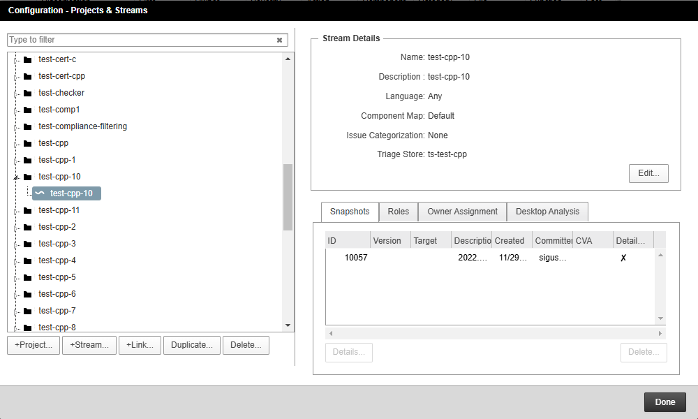
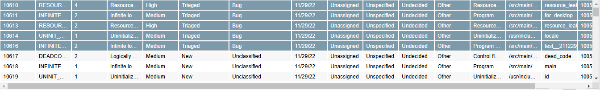
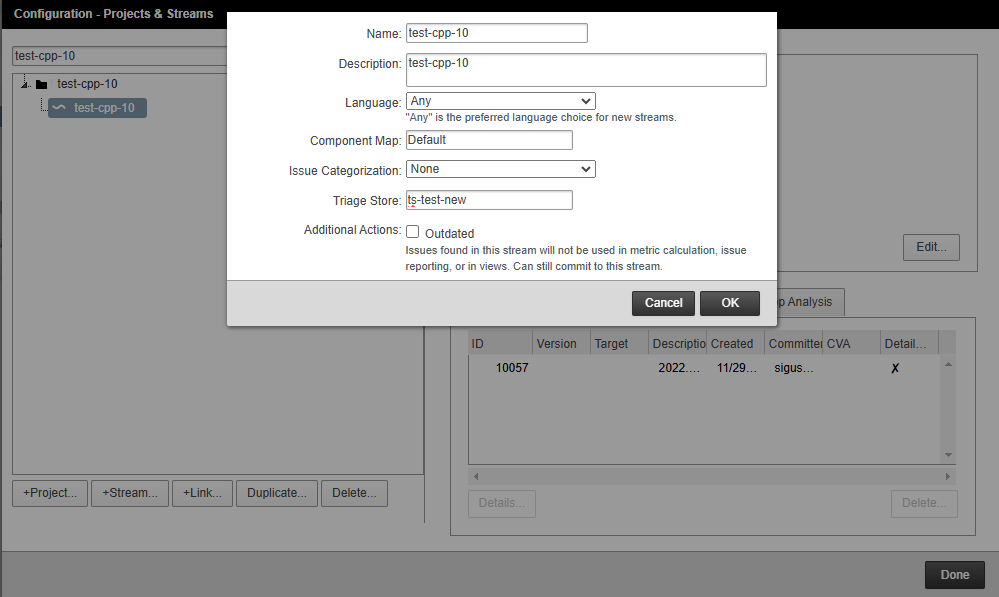
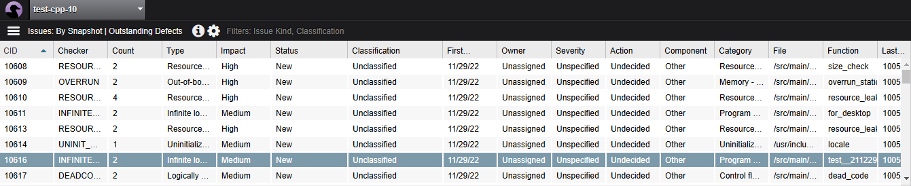
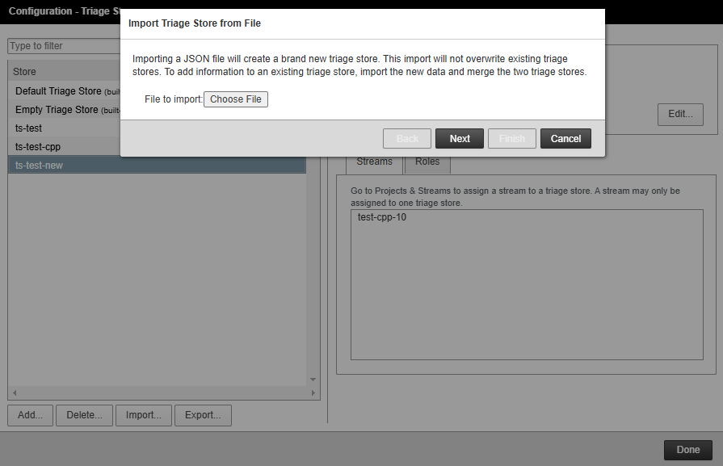
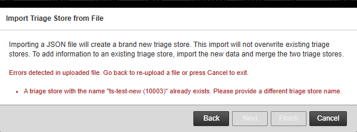
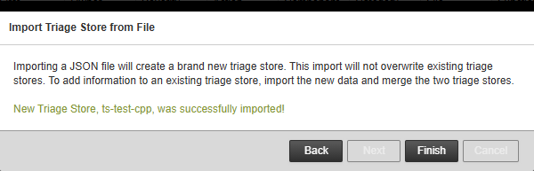
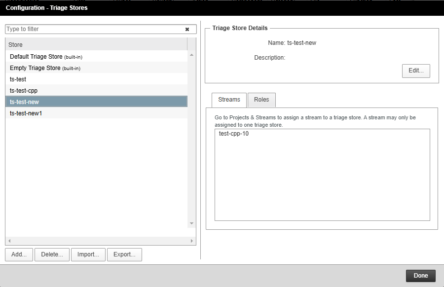
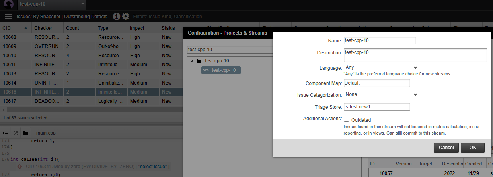
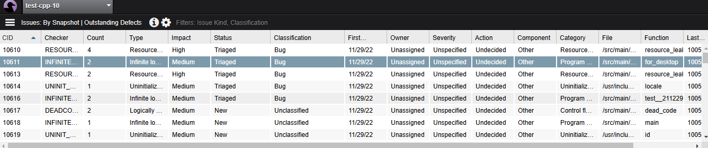

# Move Triage Store to Other
## My Work

test-cpp-10 stream의 triage store를 ts-test 에서 ts-test-new 로 변경한 경우 triage data 는 모두 사라진다.

export 한 후 새로운 triage store 이름으로 json 파일을 변경후 해당 stream을 새 triage store를 가지도록 하면 문제 해결.

https://documentation.blackduck.com/bundle/coverity-docs/page/coverity-platform/topics/managing_triage_stores.html

https://documentation.blackduck.com/bundle/coverity-docs/page/coverity-platform/topics/exported_triage_store_json_elements.html


==== Test 

* test-cpp-10 stream has ts-test-cpp triage store





* Create ts-test-new

* Export ts-test-cpp triage store
  
* test-cpp-10 stream has ts-test-new triage store



* All triage data is reset
  


* Edit exported json file to have new triage store 

from 
``` json
{
"ts-test-cpp" : [ {
  "checker" : "RESOURCE_LEAK",
  "cid" : 10608,
  "dateOriginated" : "2022-11-29T17:40:18.575Z",
  "detectedBy" : "COMMIT",
  "domain" : "STATIC_C",
  "language" : "C++",
  "mergeKey" : "c8da4fb378f1f099cc1c7ed6d2cffe97",
  "preventVersionExternal" : "2022.9.0",
  "preventVersionInternal" : "37d37bb6cf p-2022.9-push-66",
  "subcategory" : "none",
```

to 
``` json
{
"ts-test-new" : [ {
  "checker" : "RESOURCE_LEAK",
  "cid" : 10608,
  "dateOriginated" : "2022-11-29T17:40:18.575Z",
  "detectedBy" : "COMMIT",
  "domain" : "STATIC_C",
  "language" : "C++",
  "mergeKey" : "c8da4fb378f1f099cc1c7ed6d2cffe97",
  "preventVersionExternal" : "2022.9.0",
  "preventVersionInternal" : "37d37bb6cf p-2022.9-push-66",
  "subcategory" : "none",
```

* Import the triage store json file which is exported from ts-test-cpp triage store



* Conflict on triage store name
  


* Edit json to have ts-test-new1

``` json
{
"ts-test-new1" : [ {
  "checker" : "RESOURCE_LEAK",
  "cid" : 10608,
  "dateOriginated" : "2022-11-29T17:40:18.575Z",
  "detectedBy" : "COMMIT",
  "domain" : "STATIC_C",
  "language" : "C++",
  "mergeKey" : "c8da4fb378f1f099cc1c7ed6d2cffe97",
  "preventVersionExternal" : "2022.9.0",
  "preventVersionInternal" : "37d37bb6cf p-2022.9-push-66",
  "subcategory" : "none",
```

* Import
  


* Then ts-test-new1 triage store is generated




* Change test-cpp-10 stream to have ts-test-new1 triage store



* Then all triage data is restored



---

## Articles 

Articles on triage store export:
https://community.synopsys.com/s/article/How-to-copy-triage-store
https://community.synopsys.com/s/article/Copy-and-merge-feature-on-triage-store

Articles on triage store import issues:
https://community.synopsys.com/s/article/Resolving-conflict-error-while-importing-triage-store

https://community.synopsys.com/s/article/Triage-store-import-fails-due-to-inactive-users

https://community.synopsys.com/s/article/Coverity-Import-triage-store-throws-error-for-Missing-Require-Field-preventVersion


Remove/delete the streams that are not needed. Remove the triage stores that are not needed.
Here are some Articles that might be helpful on triage store export:
https://community.synopsys.com/s/article/How-to-copy-triage-store
https://community.synopsys.com/s/article/Copy-and-merge-feature-on-triage-store

Articles on triage store import issues:
https://community.synopsys.com/s/article/Resolving-conflict-error-while-importing-triage-store
https://community.synopsys.com/s/article/Triage-store-import-fails-due-to-inactive-users
https://community.synopsys.com/s/article/Coverity-Import-triage-store-throws-error-for-Missing-Require-Field-preventVersion


## Copy and merge feature on triage store

PROBLEM

The "Copy" and "Merge" feature have been removed form Coverity Connect 2019.03


SYMPTOMS/CONTEXT

Our customer sometimes reported that they can not find "Copy" and  "Merge"  button on triage store management widget 
when they try to Copy or merge some certain triage stores.

---
ENVIRONMENT:
PRODUCT (required): Coverity Connect
VERSION (required): after 2019.03
 
Solution
Solution:

Using the "Export" and  "Import" feature to implement the "Copy" and "Merge"  feature which are removed from Coverity Connect 2019.03

***Be aware that update "Copy and merge feature on triage store" article to add restriction that manually merge JSON file is not in the formal support range.

Details:

■Using the "Export" and  "Import" feature to implement the "Copy"
--
1. Export the triage store  you wan to copy
2. Unzip the .json.gz and change the triage store name in .json file.
3. Import the above .json file into CC
--

■Using the "Export" and  "Import" feature to implement the "Merge"
***Please be aware that the following steps are not officially supported. ***

--
1. Export the two triage store  you wan to Merge
2. Unzip the .json.gz respectively and merge the contents of the two .json file. manually by text editor.
#merge the triage items as following.
  {
  "checker" : "MISRA C-2012 Rule 10.4",
  "cid" : 33760,
  "dateOriginated" : "2020-02-18T22:07:22.683Z",
  "detectedBy" : "COMMIT",
  "domain" : "STATIC_C",
  "language" : "C",
  "mergeKey" : "dded2665ed4801fdaca18967bdbbc61e",
  "preventVersionExternal" : "2019.09",
  "preventVersionInternal" : "db953f1db6 p-quincy1-push-988",
  "triageStates" : [ {
    "action" : "Undecided",
    "classification" : "Unclassified",
    "comments" : "default triage, overridden by manual triage",
    "customTriage" : {
      "picklistAttributes" : { },
      "stringAttributes" : { }
    },
    "dateCreated" : "1970-01-01T00:00:00.000Z",
    "fixTarget" : "Untargeted",
    "legacy" : "False",
    "severity" : "Unspecified",
    "userCreated" : "system",
    "userCreatedLdapServerName" : "local"
  }, {
    "action" : "Undecided",
    "classification" : "Unclassified",
    "comments" : "",
    "customTriage" : {
      "picklistAttributes" : { },
      "stringAttributes" : { }
    },
    "dateCreated" : "2020-05-27T01:45:50.021Z",
    "fixTarget" : "Untargeted",
    "legacy" : "False",
    "severity" : "Moderate",
    "userCreated" : "test@synopsys",
    "userCreatedLdapServerName" : "local"
  } ]
},

3. Import the above merged .json file into CC
    #Do not forget to change the triage store name in .json file.

https://community.blackduck.com/s/article/Copy-and-merge-feature-on-triage-store

## Answer 

Yes, you can create a new triage store, then go to projects and streams and associate your old data to the new triage store, which moves the existing triage data to the new triage store. Then export the new triage store which should have only the triage data for the streams that you moved to it. Create a new project and stream for the group you are importing and associate them to the new triage store as well. When same defects from the same source code are committed on the new project and stream, the defects get updated with old triage data.

For more information on managing the triage store, please refer to the following section from Coverity platform user and admin guide:

--> 3.3.4. Managing triage stores located at "<Coverity-Install-Dir>\doc\en\" before you begin the process.

Here is an article that might help you as well:

https://community.synopsys.com/s/article/Is-it-possible-to-use-the-Triage-data-of-defects-from-the-old-server-for-the-same-defects-committed-from-the-same-source-code-on-the-new-server

Please feel free to let me know if you have any additional questions or concerns.


## How to apply triage store ?

After triage store is imported or created, it can be assigned to stream via:

Coverity Connect --> Configuration --> Project & Stream

After picking one stream, the triage store can be assigned via the Edit button.

If the triage store is not empty (for example, an imported triage store from another Coverity Connect), after it is assigned to a stream, the triage data will be applied automatically if there is any CID with the same merge key.

https://community.blackduck.com/s/article/How-to-apply-triage-store

## Can we reset a triage store ?

Issue:

Can we reset a triage store ? (to clear the triage data inside the triage store)

Solution:

Coverity Connect doesn't provide a function to clear the triage data inside the triage store.

If you need to reset the triage data of a specific stream, you can create a new (empty) triage store and assign the that stream.


https://community.blackduck.com/s/article/Can-we-reset-a-triage-store


## How to delete Triage Store

Generally you can delete triage stores from Configuration - Triage Stores - Delete button on Coverity Connect GUI. Before deleting triage store, it's required to disassociate streams with the triage store to delete.
The requirements for deleting triage store are as follows:
++++++++++++++++
Deleting a triage store:
Removes a triage store from Coverity Connect along with all its triage data and role associations.
Note that you cannot delete the Default Triage Store or a triage store that has streams associated with it. If you need to delete a triage store, you must first associate its streams with another triage store.
For required permissions, see Assigning roles.
The Delete button supports this functionality.
++++++++++++++++
To delete triage stores, a user or group requires the Manage Triage Stores permission.
The System Admin and Triage Store Owner role have this permission by default.

https://community.blackduck.com/s/article/How-to-delete-Triage-Store